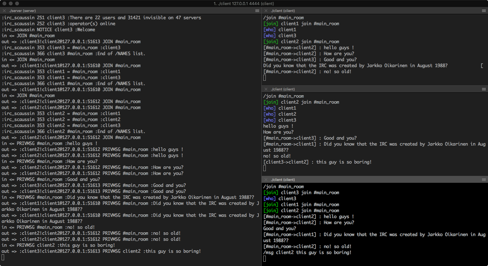

| Language | Field           | Project | Grade |
| :------: |:---------------:| :------:|:-----:|
| C      | UNIX - Network | Solo     |110/125|
# IRC
__Internet Relay Chat__ ([IRC](https://en.wikipedia.org/wiki/Internet_Relay_Chat)) is a text-based chat protocol working on a client/server networking model (TCP/IP).

## Introduction
the server and client comply with the official protocol [RFC-1459](https://tools.ietf.org/html/rfc1459).
The server can therefore accept any IRC client, and the client can connect to any IRC server.

## Server
##### Usage:
```
./server <port>
```
##### Supported commands:
* `/nick <nickname>` change nickname (max 9 characters)
* `/join <#chan>` join or create a new channel
* `/leave <#chan>` leave a channel
* `/msg <nick> <message>` send a private message
* `/list` list of channels
* `/who` list of channel members

## Client
##### Usage:
```
./client <ip> <port>
```
##### Supported commands:
* `/quit` disconnect from current server
* `/connect <ip> <port>` connect to a IRC server

## Demo
Example of 3 clients connected to the server:

